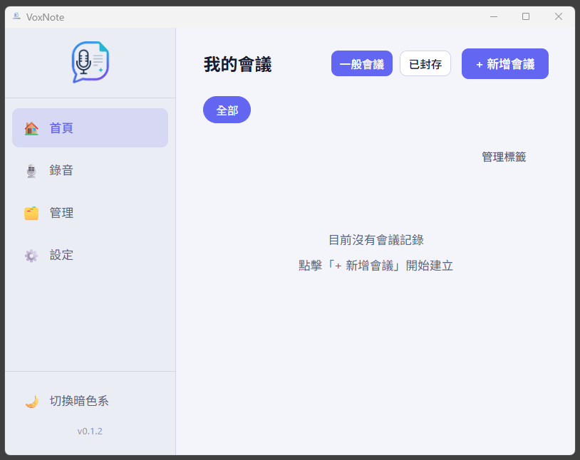

<h1 align="center">
  VoxNote
</h1>

<p align="center">
  <strong>Local-first AI Meeting Assistant</strong><br>
  Recording · Speech-to-Text · AI Proofreading · Smart Summaries
</p>

<p align="center">
  
  
  
  
  
</p>

<p align="center">
  <a href="./README.md">繁體中文</a> | English
</p>

<p align="center">
  
</p>

---

## Table of Contents

- [Introduction](#introduction)
- [Features](#features)
- [Tech Stack](#tech-stack)
- [Requirements](#requirements)
- [Quick Start](#quick-start)
- [AI Provider Setup](#ai-provider-setup)
- [ASR Setup](#asr-setup)
- [Contributing](#contributing)
- [License](#license)

---

## Introduction

VoxNote is a local-first desktop meeting assistant. All meeting data is stored in local SQLite, and audio files stay on your local disk with no mandatory cloud dependency.

It supports both AssemblyAI for cloud transcription and Whisper for local transcription, while integrating multiple LLM providers such as OpenAI, Claude, Gemini, Ollama, and OpenRouter for AI proofreading and summary generation.

```
Meeting Recording → Speech-to-Text → AI Proofreading → Smart Summary → Export
```

---

## Features

### Meeting Management

- Create, edit, and delete meetings with categories and tags
- Manage participants, including quick selection from saved contacts
- Use meeting templates with preset titles, categories, and participants

### Recording

- Desktop recording flow with a preview step before saving
- On Windows, record from microphone only, system audio only, or a mix of both
- Upload audio files in `.wav`, `.mp3`, `.m4a`, `.ogg`, `.aac`, and `.flac` up to 500 MB
- Use the built-in audio player with play, pause, seeking, and mute controls

> System audio capture currently targets Windows first and records from the default playback device.

### Speech-to-Text

- AssemblyAI cloud transcription with automatic language detection and speaker diarization
- VoxNote self-hosted ASR service combining Breeze-ASR-26 and WhisperX (requires an NVIDIA GPU)
- Local Whisper support by detecting `whisper`, `faster-whisper`, or `openai-whisper` from your system PATH

### AI Proofreading

- Fix typos, homophones, and punctuation errors
- Preserve original timestamps in `[MM:SS]` format
- Detect suspiciously shortened output and warn before overwrite
- Keep original and proofread transcript versions for easy switching

### AI Summaries

- Generate structured Markdown summaries for topics, decisions, action items, and key moments
- Support custom prompts for summary generation

### Export

- Export a full meeting bundle containing the transcript, summary, and audio file
- Export transcripts as TXT for original or proofread versions
- Export summaries as Markdown

### User Interface

- Warm-toned archival theme
- Single-column meeting list layout with clearer visual hierarchy
- Text-symbol navigation bar for improved readability

---

## Tech Stack

| Layer             | Technology                                                     |
| ----------------- | -------------------------------------------------------------- |
| Desktop framework | [Tauri 2.0](https://tauri.app/)                                |
| Backend           | Rust + [sqlx](https://github.com/launchbadge/sqlx) with SQLite |
| Frontend          | Vanilla TypeScript + [Vite](https://vitejs.dev/)               |
| AI calls          | reqwest over HTTP with no third-party AI SDK                   |
| Configuration     | TOML stored in the AppData directory                           |

```
src/                    # Frontend (Vanilla TypeScript)
├── api/                # Tauri invoke wrappers
├── components/         # DOM components
├── pages/              # Page renderers (Hash Router)
└── types/index.ts      # Shared type definitions

src-tauri/src/          # Rust backend
├── commands/           # Tauri IPC handlers
├── db/                 # SQLite CRUD and migrations
├── ai/                 # Unified LLM entry point (call_llm)
├── asr/                # Speech recognition (AssemblyAI + self-hosted service + local Whisper)
└── config/             # AppConfig loading and saving
```

---

## Requirements

### Runtime

- Windows 10 / 11 (x64)
- macOS 12+ on Apple Silicon or Intel

### Development

- [Node.js](https://nodejs.org/) 18+ or [Bun](https://bun.sh/)
- [Rust](https://rustup.rs/) 1.80+ with `cargo`
- [Tauri CLI v2](https://tauri.app/start/)

On Windows you also need C++ Build Tools:

```bash
winget install Microsoft.VisualStudio.2022.BuildTools
```

---

## Quick Start

### 1. Clone the repository

```bash
git clone https://github.com/chinglee17/voxnote.git
cd voxnote
```

### 2. Install frontend dependencies

```bash
npm install
# or use bun
bun install
```

### 3. Run in development mode

```bash
# Start only the Vite frontend (port 1420)
npm run dev

# Start the full Tauri app with the Rust backend
# The first build may take 2 to 5 minutes
npm run tauri dev
```

### 4. Build a release package

```bash
npm run tauri build
```

Build artifacts are generated under `src-tauri/target/release/bundle/`.

---

## AI Provider Setup

After launching the app, open the Settings page to configure your AI provider.

### Supported LLM providers

| Provider        | API Key Required | Notes                                                  |
| --------------- | ---------------- | ------------------------------------------------------ |
| OpenAI          | Yes              | GPT-4o and related models                              |
| Claude          | Yes              | Anthropic Claude models                                |
| Gemini          | Yes              | Google Gemini models                                   |
| OpenRouter      | Yes              | Multi-model routing                                    |
| Ollama          | No               | Local LLM, install [Ollama](https://ollama.com/) first |
| Custom endpoint | Optional         | Any OpenAI-compatible API                              |

### Quick Ollama setup

```bash
# Start Ollama
ollama serve

# Pull models (examples)
ollama pull llama3.2
ollama pull qwen2.5
```

Then enter `http://localhost:11434` in VoxNote settings and select a model.

---

## ASR Setup

### AssemblyAI (Cloud)

1. Sign up for an API key at [AssemblyAI](https://www.assemblyai.com/)
2. In VoxNote Settings, choose AssemblyAI as the ASR provider and paste the API key

### VoxNote Self-Hosted ASR Service

Located under `server/`, this service pairs **Breeze-ASR-26** (tuned for Traditional Chinese as used in Taiwan) with **WhisperX** (word-level alignment and speaker diarization) to expose an OpenAI-compatible transcription endpoint for your own infrastructure.

> **Status**: The API, Docker setup, and deployment contract are complete. Transcription quality and performance have not yet been validated on a GPU-equipped machine.

#### Prerequisites

- A machine with an **NVIDIA GPU** (driver, Docker Engine, and NVIDIA Container Toolkit)
- A Hugging Face access token (required for speaker diarization)
- Breeze-ASR-26 weights converted to CTranslate2 format (roughly 6 GB)

#### Start the service

```bash
cd server
docker compose up -d --build
curl http://localhost:8000/health
```

See **[server/README.md](./server/README.md)** for the full deployment guide, covering model conversion, pyannote licensing, environment variables, and tuning for low-VRAM machines.

#### App configuration

Go to Settings → Transcription, select "VoxNote Transcription Service", and enter the service address (for example `http://192.168.0.10:8000`).

> The service ships without authentication. Deploy it only on a trusted network.

### Local Whisper

Install any one of the following tools and make sure it is available from your system PATH:

```bash
# Option A: openai-whisper (Python)
pip install openai-whisper

# Option B: faster-whisper
pip install faster-whisper

# Option C: whisper.cpp
# See https://github.com/ggml-org/whisper.cpp
```

VoxNote detects available tools automatically at startup so you can select them in Settings.

---

## Contributing

Issues and pull requests are welcome.

### Development conventions

- Use `?` or `anyhow` for Rust error handling and avoid `.unwrap()`
- Add backend commands under `src-tauri/src/commands/` and register them in `src-tauri/src/lib.rs`
- Add frontend invoke wrappers under `src/api/` instead of calling `invoke()` directly from pages or components
- Apply database changes with backward-compatible `ALTER TABLE` migrations
- Use UUID v4 strings for all primary keys

### Branch naming

```
feature/feature-name
fix/issue-description
```

### Recommended IDE setup

[VS Code](https://code.visualstudio.com/) +
[Tauri](https://marketplace.visualstudio.com/items?itemName=tauri-apps.tauri-vscode) +
[rust-analyzer](https://marketplace.visualstudio.com/items?itemName=rust-lang.rust-analyzer)

---

## License

[MIT License](LICENSE)

---

<p align="center">Built with <a href="https://tauri.app/">Tauri</a></p>
